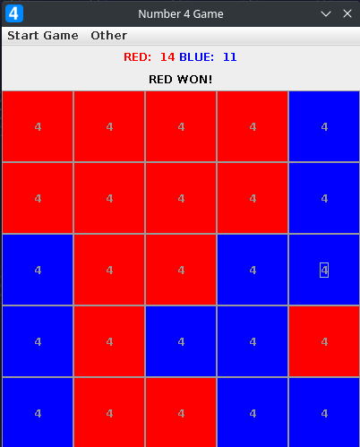

<h1>Number 4 Game</h1>

This is a simple java game for 2 players (red and blue) in which players take turns clicking numbered tiles on a grid. Upon clicking a tile, the tile's and it's neighboring tiles' (NESW) numbers increase by one. If a tile's number increases to 4, the tile becomes the color of the player who increased it. The player who turns the most tiles to their own color wins. The game can be played on a 3x3, 5x5 or a 7x7 grid.

The game itself looks like this:

Note: The project is represented as a NetBeans project. Works with up to version 16 of the IDE.
